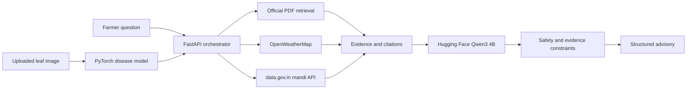

<div align="center">
  

  # eKheti

  ### AI-powered decision support for Indian farmers

  Crop disease detection, evidence-grounded agricultural advice, live weather, mandi prices, farm planning, and community support in one multilingual platform.

  [](https://ekheti-sih-qualified.vercel.app)
  [](https://nextjs.org/)
  [](https://fastapi.tiangolo.com/)
  [](https://huggingface.co/Qwen/Qwen3-4B-Instruct-2507)

  **[Try the live application](https://ekheti-sih-qualified.vercel.app)** | **[View the source](https://github.com/harshraj211/e-Kheti_SIH-qualifed)**
</div>

---

## Overview

eKheti is a full-stack precision-agriculture platform designed to turn fragmented farm data into practical decisions. A farmer can describe a crop problem, upload a leaf image, provide soil details, or ask about irrigation and fertilizer timing. eKheti combines official agricultural publications with live weather and market data, then uses Qwen3 to produce a structured, source-linked answer.

This project was built as a hackathon product and developed further as a production-oriented engineering portfolio project. It demonstrates applied AI, retrieval-augmented generation, computer vision, external API orchestration, multilingual frontend development, cloud deployment, and safety-aware response design.

## Why eKheti Stands Out

- **Grounded advice:** Retrieves evidence from official agriculture PDFs before generating recommendations.
- **Context-aware reasoning:** Combines crop stage, soil details, location, live weather, and mandi information.
- **Structured AI output:** Uses Hugging Face-hosted `Qwen/Qwen3-4B-Instruct-2507` for concise, readable advisories.
- **Safety controls:** Prevents unsupported irrigation and fertilizer conclusions when required field data is missing.
- **Computer vision:** Supports configurable PyTorch backbones for plant disease classification.
- **Built for India:** Includes official Indian agriculture sources, mandi data, and a multilingual interface.
- **Actually deployed:** Frontend runs on Vercel and the ML/RAG API runs on Render.

## Core Features

| Module | What it provides |
| --- | --- |
| AI Farming Assistant | RAG-grounded answers with structured assessment, action plan, safety notes, missing information, and source links |
| Disease Detection | Leaf-image classification with confidence score and recommended next steps |
| Live Weather Intelligence | Location-aware temperature, humidity, wind, rainfall, and advisory context |
| Mandi Market Prices | Crop-price lookup using official `data.gov.in` / Agmarknet data |
| Crop & Fruit Management | Separate workflows for crop and fruit planning |
| Crop Simulation | Profitability and farm-scenario exploration |
| Crop Calendar | Activity planning across crop stages |
| Expense Tracker | Farm income and expense monitoring |
| Calculators | Practical agricultural calculations inside the dashboard |
| Community Forum | Posts, comments, likes, and Cloudinary-backed image uploads |
| Voice & Multilingual UI | Voice-oriented interaction and locale files for multiple Indian languages |
| Reports & Notifications | Printable chat reports, weather alerts, price alerts, and farming reminders |

## AI System



### Retrieval-Augmented Generation

The knowledge base contains official guides from organizations such as ICAR, PAU, TNAU, NHB, NFSM, and state agriculture bodies. The indexing pipeline extracts and chunks the documents into `ml/rag_index.jsonl`. At runtime, the API retrieves relevant passages and appends verified title, page, host, and source URL information to the final answer.

### Qwen Advisory Generation

The production chatbot uses **Qwen3-4B-Instruct-2507** through Hugging Face Inference Providers. The model receives only the selected evidence, live context, recent conversation history, and facts extracted from the farmer's question. Responses follow a stable format:

1. Assessment
2. What to do now
3. Next 7 days
4. Safety
5. Missing information
6. Verified sources

### Agricultural Safety Layer

Generation is followed by deterministic evidence checks. For example, eKheti does not claim that irrigation is required when field-moisture or standing-water information is missing. It also avoids selecting variety-dependent fertilizer timing when the farmer has not supplied the crop variety, and removes unrelated chemical treatments from the final response.

### Disease Classification

The training pipeline supports multiple torchvision architectures:

- MobileNetV3 Small
- EfficientNet-B0
- EfficientNet-B3
- ConvNeXt Tiny

This makes it possible to choose a lightweight model for local inference or a stronger model for Kaggle/cloud GPU training. The intended mixed training corpus combines controlled-background and field-style datasets such as New Plant Diseases, PlantDoc, tomato leaf disease, and rice leaf disease datasets.

## Technology Stack

| Layer | Technologies |
| --- | --- |
| Frontend | Next.js 16, React 18, TypeScript, Tailwind CSS, Radix UI, Recharts |
| Backend & ML | FastAPI, Python 3.11, PyTorch, torchvision, Transformers, PEFT/LoRA, Pydantic |
| Language Model | Hugging Face Inference Providers, Qwen3-4B-Instruct-2507 |
| Knowledge System | PDF extraction, local RAG index, source metadata and page-level citations |
| Data Services | OpenWeatherMap, data.gov.in / Agmarknet, NewsData |
| Media | Cloudinary |
| Deployment | Vercel frontend, Render API, Hugging Face inference |

## Repository Structure

```text
e-Kheti_SIH-qualifed/
|-- src/
|   |-- app/                 # Next.js routes, dashboard pages, and API routes
|   |-- ai/flows/            # Chat, disease, weather, news, and simulation flows
|   |-- components/          # Reusable dashboard and UI components
|   |-- lib/                 # AI client, market, PDF, and shared utilities
|   |-- locales/             # Indian-language translation resources
|   `-- services/            # External service integrations
|-- ml/
|   |-- api.py               # FastAPI orchestration, RAG, APIs, and safety layer
|   |-- train_disease_classifier.py
|   |-- train_advisory_lora.py
|   |-- build_rag_index.py
|   |-- rag_docs/            # Official agriculture publications
|   `-- rag_index.jsonl      # Searchable document chunks
|-- public/                  # PWA assets and icons
`-- docs/                    # Product and architecture documentation
```

## Run Locally

### Prerequisites

- Node.js 20+
- Python 3.11
- Git

### 1. Clone and install the frontend

```powershell
git clone https://github.com/harshraj211/e-Kheti_SIH-qualifed.git
cd e-Kheti_SIH-qualifed
npm install
```

### 2. Configure environment variables

Create `.env` in the repository root. Never commit real credentials.

```env
LOCAL_AI_BASE_URL=http://127.0.0.1:8000

OPENWEATHERMAP_API_KEY=
DATA_GOV_API_KEY=
AGMARKNET_API_KEY=
NEWSDATA_API_KEY=

CLOUDINARY_CLOUD_NAME=
CLOUDINARY_API_KEY=
CLOUDINARY_API_SECRET=

# Optional hosted generation
HF_QWEN_API_URL=https://router.huggingface.co/v1/chat/completions
HF_QWEN_MODEL=Qwen/Qwen3-4B-Instruct-2507
HF_API_TOKEN=
```

### 3. Start the frontend

```powershell
npm run dev
```

Open `http://localhost:9002`.

### 4. Set up and start the ML API

```powershell
py -3.11 -m venv .venv
.\.venv\Scripts\Activate.ps1
.\ml\setup_windows.ps1
.\ml\build_rag_index_windows.ps1
.\ml\start_api_windows.ps1
```

The FastAPI service runs at `http://127.0.0.1:8000`. Check readiness at `http://127.0.0.1:8000/health`.

## Training

### Disease classifier

```powershell
# EfficientNet baseline
.\ml\train_disease_windows.ps1

# Stronger ConvNeXt configuration
.\ml\train_disease_strong_windows.ps1
```

Manual architecture selection is also supported:

```powershell
.\.venv\Scripts\python.exe .\ml\train_disease_classifier.py --architecture efficientnet_b0 --batch-size 24
```

### Advisory LoRA

```powershell
.\ml\train_advisory_windows.ps1
```

GPU training is recommended for both workflows. Kaggle dual-T4 sessions or another CUDA environment can be used for larger datasets and stronger backbones.

## Deployment

| Service | Responsibility | Deployment |
| --- | --- | --- |
| Web application | User interface and Next.js API routes | [Vercel](https://ekheti-sih-qualified.vercel.app) |
| ML orchestration | RAG, weather, market context, disease API, safety checks | Render |
| Text generation | Qwen3 inference | Hugging Face Inference Providers |
| Community media | Uploaded images | Cloudinary |

Production secrets belong in the provider's environment-variable settings, never in browser-exposed variables or source control.

## Engineering Highlights

- Replaced an external Gemini dependency with an independently controlled RAG and Hugging Face generation pipeline.
- Designed a hybrid AI architecture that keeps retrieval and agricultural policy logic separate from language generation.
- Added page-level source attribution instead of displaying raw PDF filenames.
- Integrated real-time weather and market data into conversational responses.
- Built deterministic post-generation checks for high-impact agronomy advice.
- Implemented graceful fallback behavior when hosted generation is unavailable.
- Created configurable computer-vision training workflows for local and cloud GPUs.
- Shipped a responsive dashboard with multilingual, reporting, finance, planning, and community modules.

## Current Limitations & Roadmap

- Move community posts and comments from browser storage to MongoDB/PostgreSQL.
- Upgrade lexical retrieval to multilingual embeddings plus reranking.
- Add hourly and seven-day forecast data with rainfall probability.
- Evaluate the chatbot against a curated, expert-reviewed agriculture benchmark.
- Train and validate the disease model on a larger mixed field-image dataset.
- Add persistent farm profiles for acreage, crop variety, soil tests, and irrigation method.
- Add observability for model latency, retrieval quality, API failures, and user feedback.

## Responsible Use

eKheti is a decision-support system, not a replacement for an agronomist, KVK specialist, product label, or local agriculture authority. Chemical selection and dosage must be verified against the crop, diagnosis, local registration, weather conditions, and official recommendations.

## Author

**Harsh Raj**

- GitHub: [@harshraj211](https://github.com/harshraj211)
- Project: [eKheti live demo](https://ekheti-sih-qualified.vercel.app)

## License

This repository is currently provided for educational, hackathon, demonstration, and portfolio purposes. Add a formal open-source license before reuse or redistribution.

---

<div align="center">
  Built to make agricultural intelligence practical, explainable, and accessible.
</div>
